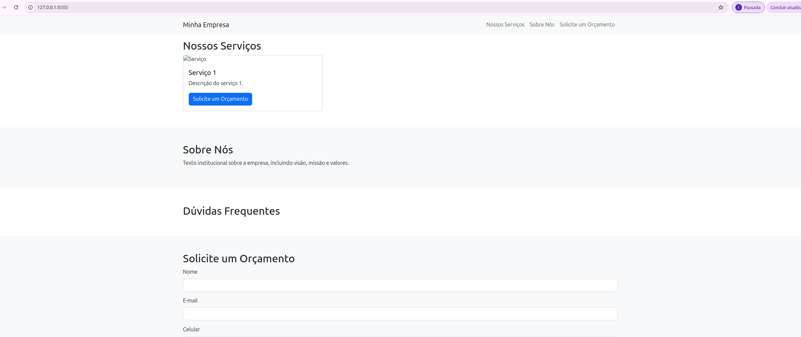
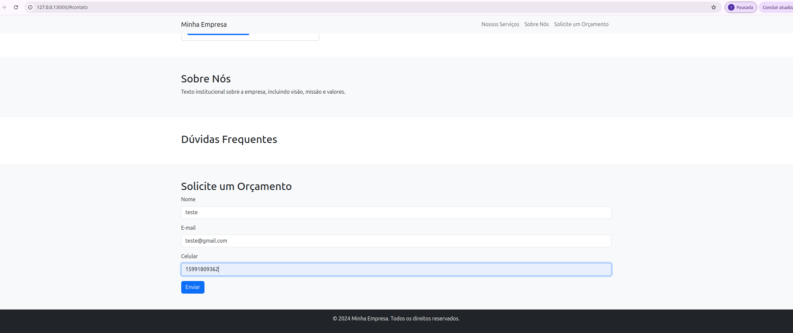
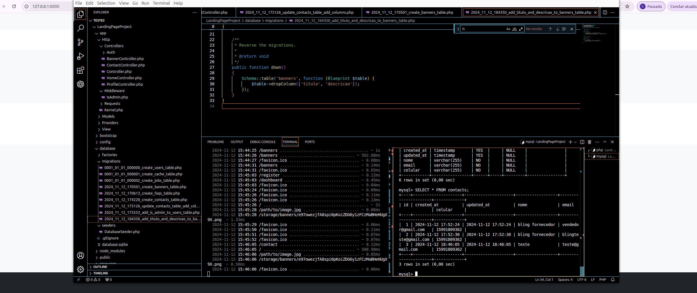
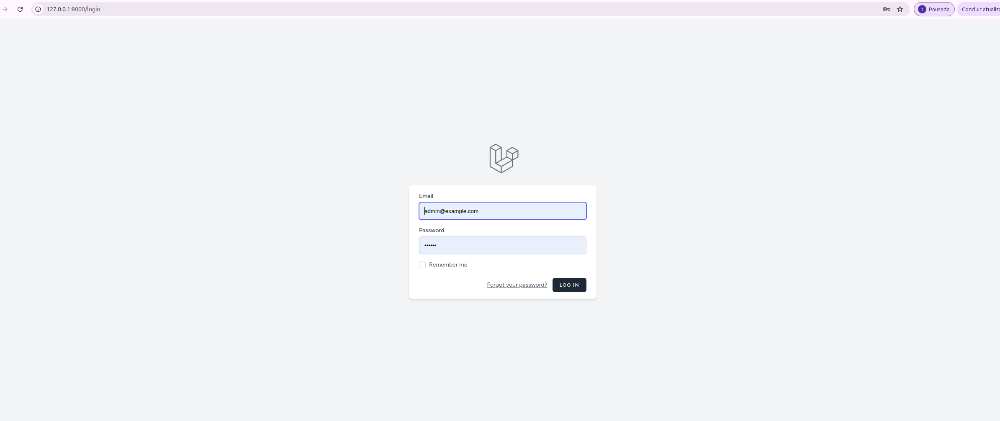
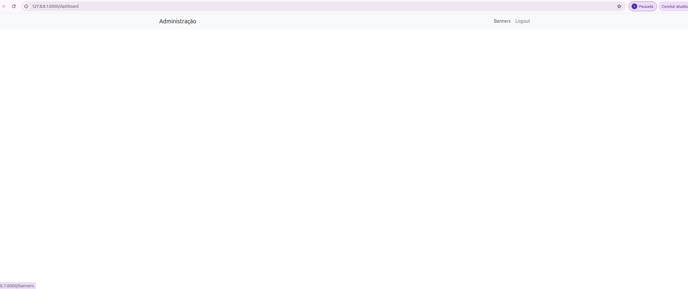
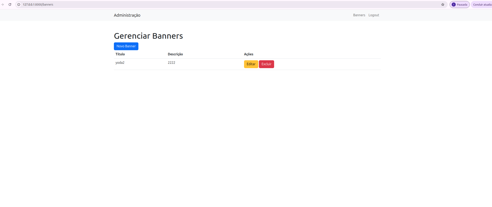
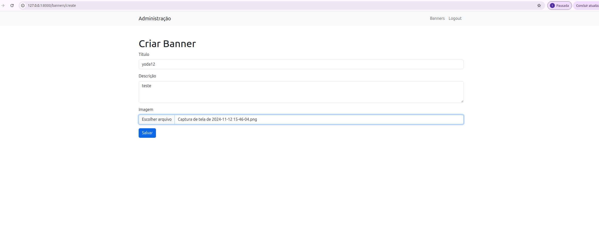
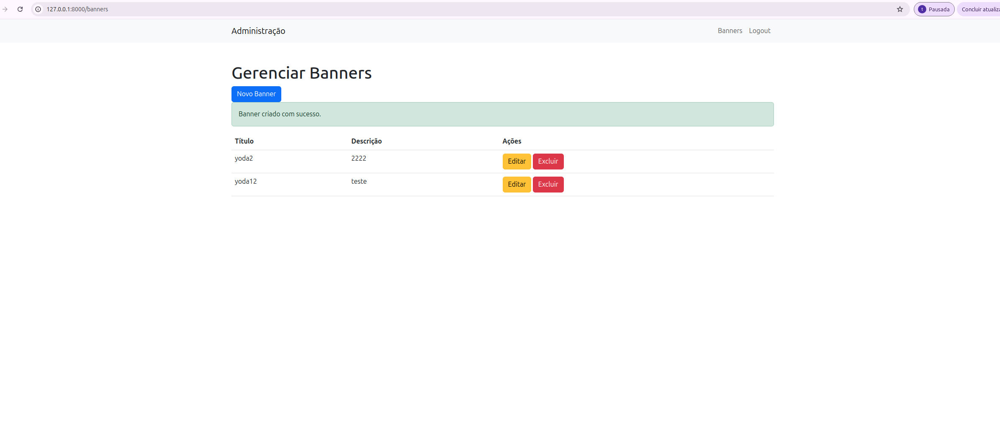

<center> <h1>💻 Bem vindo 💻</h1> </center>

## Como instalar o projeto
1- Clone o repositorio em sua maquina
 ```bash
   git clone "URL DO PROJETO"
   ```

2- Instale as  dependencias do projeto com os seguintes comandos:

   ```bash
    composer install
    npm install
   ```

3- Configure o .env
siga este modelo de .env

```bash
APP_NAME=Laravel
APP_ENV=local
APP_KEY=base64:wCeA8G2K5U+NEgYo4ZUB1gGCKC1x0TG8yZDB5yxo9Lc=
APP_DEBUG=true
APP_TIMEZONE=UTC
APP_URL=http://localhost

APP_LOCALE=en
APP_FALLBACK_LOCALE=en
APP_FAKER_LOCALE=en_US

APP_MAINTENANCE_DRIVER=file
# APP_MAINTENANCE_STORE=database

PHP_CLI_SERVER_WORKERS=4

BCRYPT_ROUNDS=12

LOG_CHANNEL=stack
LOG_STACK=single
LOG_DEPRECATIONS_CHANNEL=null
LOG_LEVEL=debug

DB_CONNECTION=sqlite


SESSION_DRIVER=database
SESSION_LIFETIME=120
SESSION_ENCRYPT=false
SESSION_PATH=/
SESSION_DOMAIN=null

BROADCAST_CONNECTION=log
FILESYSTEM_DISK=local
QUEUE_CONNECTION=database

CACHE_STORE=database
CACHE_PREFIX=

MEMCACHED_HOST=127.0.0.1

REDIS_CLIENT=phpredis
REDIS_HOST=127.0.0.1
REDIS_PASSWORD=null
REDIS_PORT=6379

MAIL_MAILER=log
MAIL_HOST=127.0.0.1
MAIL_PORT=2525
MAIL_USERNAME=null
MAIL_PASSWORD=null
MAIL_ENCRYPTION=null
MAIL_FROM_ADDRESS="hello@example.com"
MAIL_FROM_NAME="${APP_NAME}"

AWS_ACCESS_KEY_ID=
AWS_SECRET_ACCESS_KEY=
AWS_DEFAULT_REGION=us-east-1
AWS_BUCKET=
AWS_USE_PATH_STYLE_ENDPOINT=false

VITE_APP_NAME="${APP_NAME}"


DB_CONNECTION=mysql
DB_HOST=127.0.0.1
DB_PORT=3306
DB_DATABASE=landing_page_db
DB_USERNAME=seu_users     # Nome do usuário criado ou já existente no MySQL
DB_PASSWORD=sua_senha   # Senha configurada para o usuário MySQL
```

4- Rode as migrations

   ```bash
php artisan migrate

```

5- Após isto rode o comando para abrir o server
   ```bash

php artisan serve


   ```

<h3> Usuários📌</h3>
Para inserir um novo usuário administrador diretamente no banco de dados, siga estas instruções:

Crie um Novo Usuário Administrador via SQL:

Conecte-se ao banco de dados MySQL com o mesmo comando que você usou para verificar as tabelas:
 ```bash
use o comando para conectar ao banco
mysql -u seu_usuario -p

--------------------------
sql
Copiar código
USE landing_page_db;
Insira o Novo Usuário:

Execute o comando abaixo para criar um novo usuário com permissões de administrador. Substitua novo_admin@example.com pelo email desejado, e 123456 pela senha desejada.

Lembre-se de que a senha precisa ser criptografada com Bcrypt para ser aceita pelo sistema. O exemplo a seguir utiliza o hash da senha 123456.

sql
Copiar código
INSERT INTO users (name, email, email_verified_at, password, created_at, updated_at, is_admin) 
VALUES (
    'Novo Admin', 
    'novo_admin@example.com', 
    NOW(), 
    '$2y$12$3Rgy9sseQBhfsWmjLRSmu.HlUd3ag4FbMWbm5ZcFf0lv.WANW9/pm', 
    NOW(), 
    NOW(), 
    1
);
Aqui, NOW() define a data de criação e atualização automaticamente, e o valor 1 em is_admin torna o usuário um administrador.

Confirme a Inserção:

Você pode verificar se o usuário foi inserido corretamente com o comando:

sql
Copiar código
SELECT * FROM users WHERE email = 'novo_admin@example.com';
   ```


--------------------


<h3> rotas para teste📌</h3>

Rotas Públicas

Rotas de Autenticação (somente para visitantes - middleware guest)

GET /login - Exibe o formulário de login. (Usa o AuthenticatedSessionController@create)
POST /login - Processa o login do usuário. (Usa o AuthenticatedSessionController@store)

Rotas Autenticadas (middleware auth)
GET /dashboard - Exibe o painel (dashboard) principal para usuários autenticados. (Usa uma função anônima, middleware(['auth', 'verified']))
GET /profile - Exibe o formulário para edição do perfil do usuário. (Usa o ProfileController@edit)
PATCH /profile - Atualiza os dados do perfil do usuário. (Usa o ProfileController@update)
DELETE /profile - Exclui a conta do usuário. (Usa o ProfileController@destroy)
POST /logout - Realiza o logout do usuário. (Usa o AuthenticatedSessionController@destroy)

Rotas de Administração (middleware auth e is_admin)
GET /banners - Exibe uma lista de banners. (Usa o BannerController@index)
GET /banners/create - Exibe o formulário para criar um novo banner. (Usa o BannerController@create)
POST /banners - Armazena um novo banner. (Usa o BannerController@store)
GET /banners/{banner} - Exibe os detalhes de um banner específico. (Usa o BannerController@show)
GET /banners/{banner}/edit - Exibe o formulário para edição de um banner. (Usa o BannerController@edit)
PUT/PATCH /banners/{banner} - Atualiza um banner existente. (Usa o BannerController@update)
DELETE /banners/{banner} - Exclui um banner. (Usa o BannerController@destroy)
Essas rotas formam a estrutura principal para navegação, autenticação e administração no projeto, permitindo fácil gestão e interação com os recursos, especialmente os banners.


--------------------------


<h3> Imagens funcionamento📌</h3>










## Autor

Feito por Matheus Torsoni👋🏽 Entre em contato!

[](https://twitter.com/tcmatheus_) [](https://www.linkedin.com/in/matheus-torsoni-b33957156/) 
[](matheus_tcampos@hotmail.com)
